## Loving Sitter

Loving Sitter is a full-stack CRUD website that helps dog owners find dogsitters. Users can create accounts and find dogsitters based on their location and schedule. The site also includes real-timemessaging functionality between users for streamlined communication between dog owners and dogsitters. Payments to dogsitters is done using Stripe. Dog owners can submit reviews of dogsitters after receiving dogsitting services.

**Tech Stack:** MongoDB, Express.js, React.js, Node.js, Typescript
**Technologies/Libraries:** Socket.io, Stripe, Cloudinary

**Contributors**: [Wilson Fong](https://github.com/siuwafong), [David Lee](https://github.com/davidleecodes), [Alex Duria](https://github.com/Duria73)

---

### Getting Started

1. Clone or download repository

---

## Server

1. Go into the server directory `cd server`
2. Run `npm install` to install packages
3. Create your environment variable (.env) file. The following envrionment variables are required:
 * JWT_SECRET - [link](https://www.npmjs.com/package/jsonwebtoken)
 * MONGO_URI - [link](https://www.mongodb.com/)
 * CLOUDINARY_CLOUD_NAME - [link](https://cloudinary.com/)
 * CLOUDINARY_KEY - [link](https://cloudinary.com/)
 * CLOUDINARY_SECRET - [link](https://cloudinary.com/)
 * STRIPE_KEY - [link](https://stripe.com/docs/keys)
4. Run `npm run dev` to start the server

---

## Client

1. Go into the client directory `cd client`
2. Run `npm install` to install packages
3. Create your environment variable (.env) file. The following envrionment variables are required:
  * REACT_APP_STRIPE_PKEY - [link](https://stripe.com/docs/keys)
4. Run `npm start` to start the client side

---

### Demo

1. Registration/Login. Users will be able to create a new account using a username, email and password or sign in with their email and password

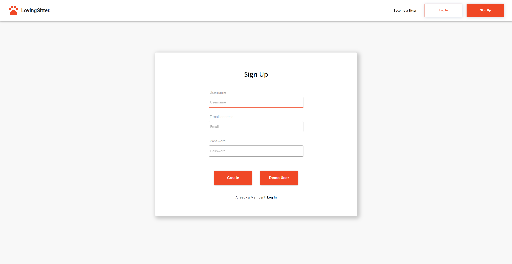
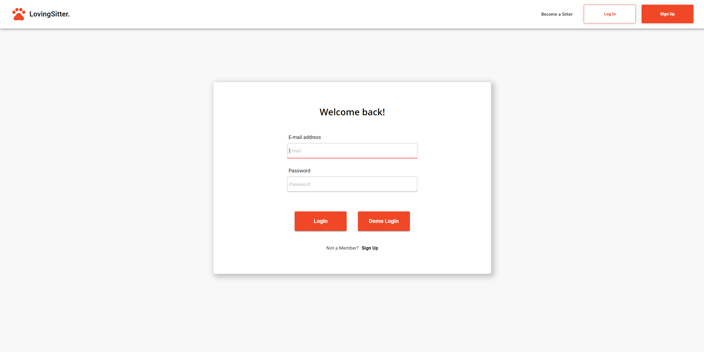

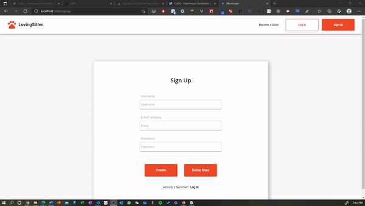

2. Search. Users can find dogsitters based on their schedule and location

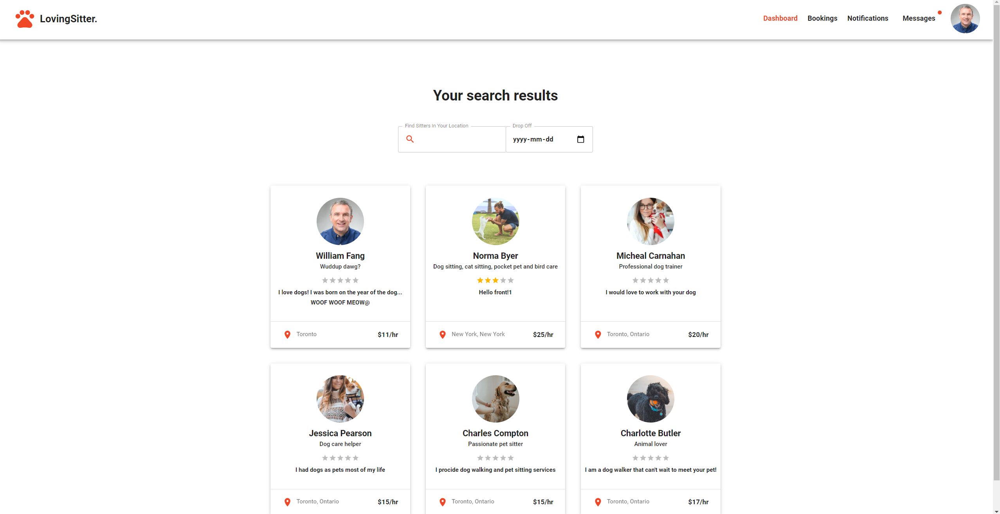

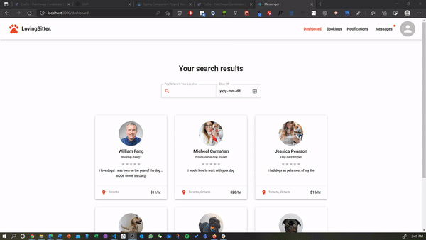

3. Profile Details. Users can click on a dogsitter's profile to view more images and reviews from other users. They can also send booking requests.

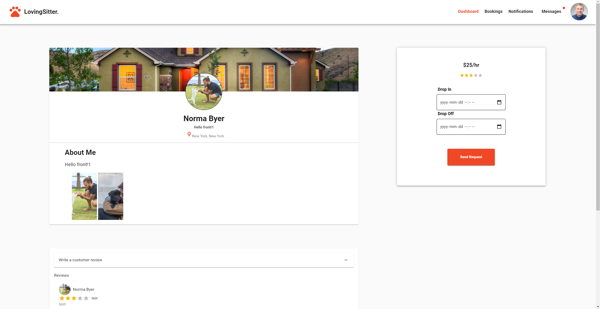

4. Notifications. Users can get real-time notifications when another user books, cancels, or sends a request for dogsitting.

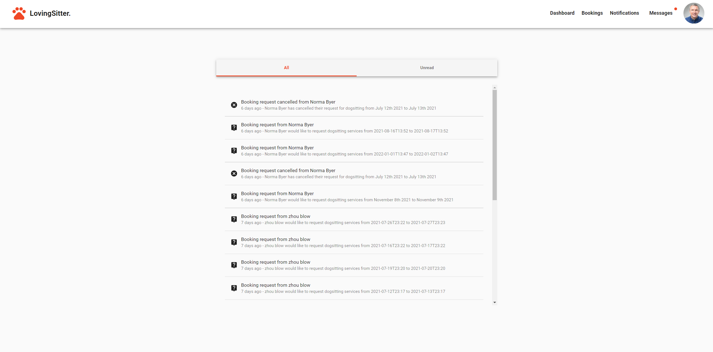

5. Bookings. Once another user has sent a booking request, dogsitters and dog owners can view their booking requests based on their schedule. Dog owners can choose to cancel their requests. Dogsitters can choose to accept or decline offers for dog sitting.

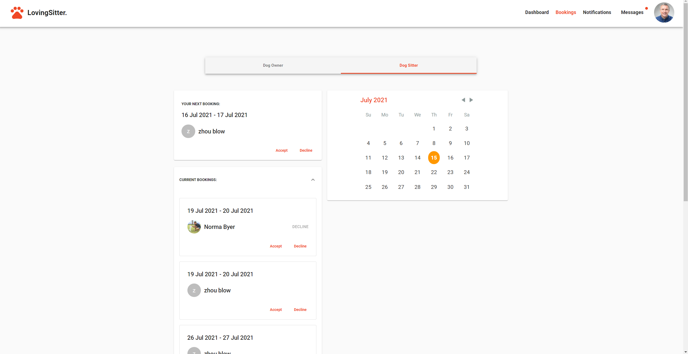

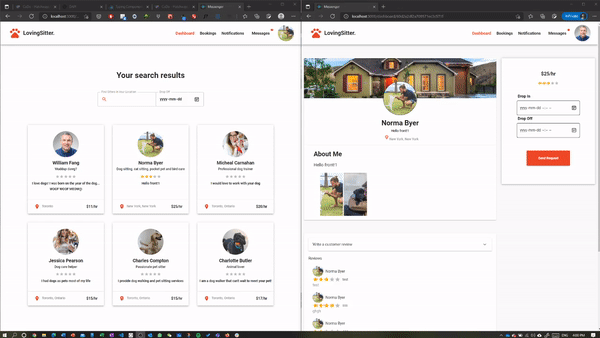

6. Messages. Once a dog owner has sent a request for dogsitting services, a conversation is created between the dog owner and dogsitter, and they can message in real-time in the messages section.

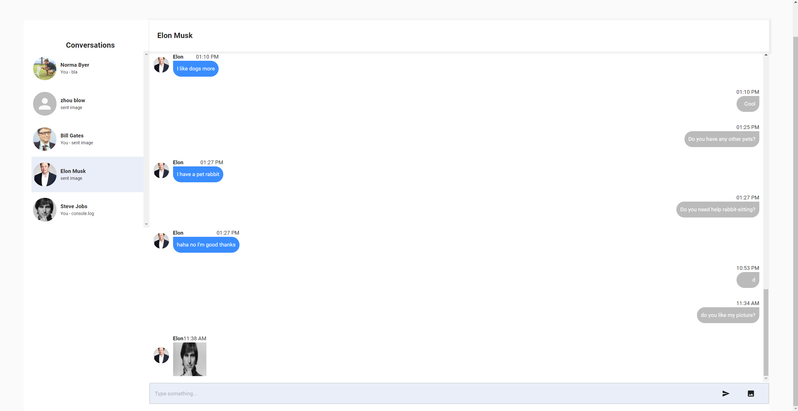

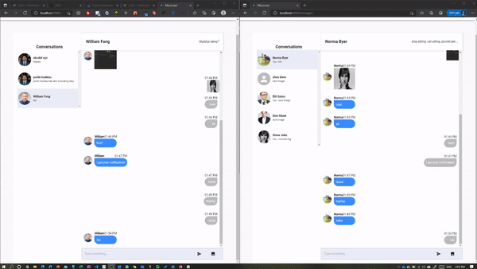

7. Profile Settings. Users can edit their profile by changing their name, availability, description, tagline and images

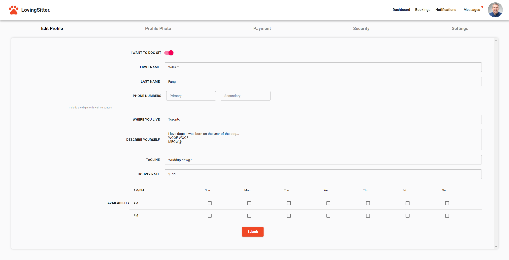

